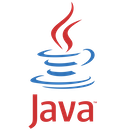

# EOSIO SDK for Java: RPC Provider (sans Android)


[](/./LICENSE)


A fork of the [eosio-java-android-rpc-provider](https://github.com/EOSIO/eosio-java-android-rpc-provider) that strips out the Android parts to make it suitable for use with Java.

Available from gradle with same dependency name as standard, but with repository.

```groovy
repositories {
    maven {
        url  "https://dl.bintray.com/lfeagan/eosiojava"
    }
}
```

```groovy
implementation 'one.block:eosiojavarpcprovider:0.1.0'
```
